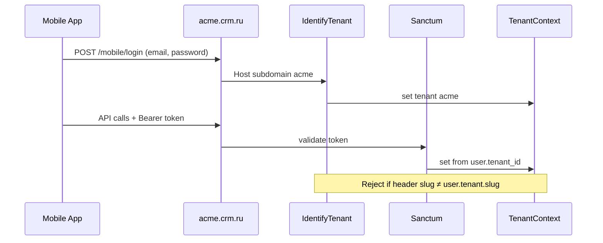

# SaaS Product Roadmap Brief — архитектурный бриф

> **Дата:** 2026-07-11  
> **Статус:** Phase M5 done → M6/M7  
> **Аудитория:** product director, cloud agents, `saas-architect`  
> **Источники:** `AGENTS.md`, `docs/sync/architecture-plan.md`, ADR-001..003, код `main`

---

## Контекст: что сделано vs что отсутствует

### ✅ Реализовано (M5 — tenancy skeleton)

| Компонент | Состояние | Файлы |
| --- | --- | --- |
| Модель `Tenant` | slug, name, status, plan, settings JSON, trial_ends_at | `app/Models/Tenant.php`, migration `2026_07_11_100000_create_tenants_table.php` |
| `tenant_id` на core-таблицах | **Только 4 таблицы:** users, contractors, leads, orders | `database/migrations/2026_07_11_100001_add_tenant_id_to_core_tables.php` |
| `BelongsToTenant` + `TenantScope` | На 4 моделях | `app/Models/Concerns/BelongsToTenant.php`, `app/Models/Scopes/TenantScope.php` |
| `TenantContext` | set/get/bypass/runAs/runWithoutScope | `app/Support/TenantContext.php` |
| `IdentifyTenant` middleware | subdomain → slug, `X-Tenant-Slug`, fallback `config('saas.default_tenant_slug')` | `app/Http/Middleware/IdentifyTenant.php` |
| Middleware stack | **Только `web` prepend** — API без tenant resolution | `bootstrap/app.php` |
| Demo seed | demo, demo-a, demo-b | `SaasDemoSeeder`, `TenantDemoSeeder` |
| Isolation tests | orders, contractors, login default tenant | `tests/Feature/Saas/TenantIsolationTest.php` |
| Plan column | `tenants.plan` = start/pro/enterprise (строка, без enforcement) | migration tenants |

### ❌ Критические пробелы (блокеры paying customers)

| Пробел | Риск | Детали |
| --- | --- | --- |
| **~100+ моделей без `tenant_id`** | Cross-tenant IDOR | tasks, order_documents, payment_schedules, roles, departments, mail_*, conversations, grid_views, print_form_templates… |
| **`TenantScope` fail-open при null context** | Утечка всех tenants | `TenantScope` не фильтрует, если `TenantContext::id() === null` |
| **API routes без `IdentifyTenant`** | Mobile/MCP видят все данные | `routes/api.php` — только `auth:sanctum`, нет tenant middleware |
| **Roles глобальные** | RBAC конфликт между tenants | `Role` без `tenant_id`; seeder создаёт shared roles |
| **Email unique глобально** | Нельзя один email в двух tenants / login ambiguity | `LoginRequest` → `Auth::attempt` без явной проверки `user.tenant_id === context` |
| **Файлы не изолированы** | Документы всех tenants в одном tree | `config/filesystems.php` — нет `tenants/{id}/`; сервисы пишут в `storage/app/private` |
| **Feature flags не enforced** | Все модули доступны всем | `settings.features` в seeder, но нет middleware/каталога планов |
| **Mobile = Traklo/AA брендинг** | Не продаётся внешним клиентам | `MobileAppUpdateController`, `config/mobile_app.php`, `config/ai_agents.php`, `InertiaAppSurface` |
| **M6 audit pending** | Scope leaks × tenancy | P0.10, P1.1 — `docs/architecture/saas-audit-remediation.md` |
| **Queue/commands без tenant context** | Фоновые jobs без изоляции | Нет `TenantContext::set()` в jobs |
| **Billing / super-admin** | Нет монетизации и ops | Нет `tenant_subscriptions`, suspend, usage |

---

## A) IMMEDIATE — следующие 1–2 спринта

### A1. Нейтральный брендинг (S)

**Цель:** убрать Avtoalyans/Traklo из дефолтов SaaS; бренд = per-tenant `settings.branding`.

| Задача | Область файлов |
| --- | --- |
| Env-дефолты: «Forward CRM» / «Экспедитор CRM» вместо AA | `config/app.php` (`crm_browser_title`, `showcase_browser_title`), `.env.example` |
| Fallback title во frontend | `resources/js/app.js` (строка «CRM компании Автоальянс…») |
| Inertia shared props: tenant name + branding | `HandleInertiaRequests.php` → share `tenant: { name, slug, branding }` из `TenantContext` |
| AI personas: нейтральные prompt_lead | `config/ai_agents.php` — убрать «Автоальянс»; display names оставить (Джарвис/Галя — нейтральны) |
| Mobile app manifest: configurable per tenant/platform | `config/mobile_app.php`, `MobileAppUpdateController` — `app_name` из config/tenant, не hardcode `Traklo` |
| Public transport request page | `resources/js/Pages/Public/TransportRequest.vue` — tenant-aware или отключить на SaaS |
| Seeded demo content | уже нейтрально в `SaasDemoSeeder` ✅ |

**Минимальная схема `tenants.settings.branding`:**

```json
{
  "branding": {
    "product_name": "Forward CRM",
    "mobile_app_name": "Forward Mobile",
    "primary_accent": "sky",
    "logo_path": null
  },
  "features": ["leads", "orders", "contractors", "tasks"]
}
```

### A2. Tenant isolation — закрыть gaps (L)

**Цель:** fail-closed изоляция на всех Tier A/B таблицах из architecture-plan §5.

| # | Задача | Файлы / действия |
| --- | --- | --- |
| 1 | Миграция `tenant_id` Tier A (~40 таблиц) | `database/migrations/2026_07_XX_add_tenant_id_tier_a.php` — orders children, leads children, tasks, mail, conversations, payment_schedules, fleet, documents |
| 2 | Миграция Tier B (~25 таблиц) | roles, departments, print_form_templates, sales_scripts*, grid_views, business_processes, kpi_settings… |
| 3 | `BelongsToTenant` на все Eloquent-модели Tier A/B | `app/Models/*.php` — grep моделей без trait |
| 4 | **`TenantScope` fail-closed** | `TenantScope.php`: если context null и не bypass → `whereRaw('1=0')` или exception в non-console |
| 5 | **`SetTenantFromAuthenticatedUser` middleware** | Новый middleware после auth: `TenantContext::set($user->tenant)`; проверка `user.tenant_id === context.tenant_id` |
| 6 | **`IdentifyTenant` на API group** | `bootstrap/app.php` — prepend к `api`; + header `X-Tenant-Slug` для pre-auth |
| 7 | Composite unique `(tenant_id, email)` на users | migration + `LoginRequest` explicit tenant check |
| 8 | `tenant_id` на roles + per-tenant seed | `Role`, `SaasDemoSeeder`, `TenantDemoSeeder` |
| 9 | Расширить isolation tests | HTTP tests: tenant A token → tenant B order ID = 404; API messenger; raw DB queries с join |
| 10 | Jobs middleware | `app/Jobs/Middleware/SetTenantFromJob.php` + `$this->tenantId` в job payload |

**Приоритет таблиц (первая волна миграции):**

`tasks`, `order_documents`, `payment_schedules`, `payment_schedule_payment_events`, `roles`, `departments`, `conversations`, `chat_messages`, `mail_threads`, `mail_messages`, `grid_views`, `print_form_templates`, `activity_events`

### A3. File storage isolation (M)

**Цель:** `storage/tenants/{tenant_id}/` как в ADR-002.

| Задача | Файлы |
| --- | --- |
| Disk `tenant` dynamic root | `config/filesystems.php` + `App\Support\TenantStorage` helper: `diskFor(Tenant): Filesystem` |
| Path prefix helper | `TenantStorage::path('documents/…')` → `tenants/{id}/documents/…` |
| Переключить upload/download | `OrderPrintFormDraftService`, `DocumentRegistryController`, `TaskAttachment`, mail attachments — grep `Storage::disk` |
| Tenant provisioning | `Tenant::boot()` or observer → `Storage::makeDirectory("tenants/{$id}")` |
| Test | Upload in tenant A → file not readable from tenant B path |

**S3-ready (later):** prefix `s3://bucket/tenants/{id}/` — тот же helper.

### A4. Plan / feature flags skeleton (M)

**Цель:** enforcement по ADR-003 до pilots (M7.1).

| Задача | Файлы |
| --- | --- |
| Plan catalog config | `config/saas-plans.php` — start/pro/enterprise → features[], limits |
| `Tenant::featureEnabled(string $key): bool` | merge plan defaults + `settings.features` overrides |
| `EnsureFeatureEnabled` middleware | `app/Http/Middleware/EnsureFeatureEnabled.php` — alias `feature:{key}` |
| Route groups | `routes/web.php` — finance, mail, documents, MCP, load_board, management_accounting |
| Inertia share | `tenant.features`, `tenant.plan`, `tenant.limits` в `HandleInertiaRequests` |
| Vue menu filter | reuse pattern `visibility_areas` — `CrmFeatureCatalog` + tenant features |
| Seed plans | demo=pro, demo-a/b=start |

**Не Pennant на MVP** — `tenant.settings` + config catalog проще и уже в ADR-003. Pennant — опция при A/B и per-user flags позже.

### A5. Mobile tenant resolution (M)

**Цель:** mobile app работает per tenant без Traklo coupling.

| Канал | Когда | Реализация |
| --- | --- | --- |
| **Subdomain base URL** | Native app config | `{slug}.crm.ru` — каждый tenant свой API host (MVP) |
| **`X-Tenant-Slug` header** | Pre-auth, shared domain | Уже в `IdentifyTenant` ✅ — документировать контракт |
| **Sanctum token → user.tenant_id** | Post-auth API | `SetTenantFromAuthenticatedUser` — обязательно на `api` group |
| **Token metadata (optional P1)** | Multi-tenant app binary | При создании token: Sanctum `abilities` include `tenant:{id}`; validate on each request |
| **Mobile login tenant check** | Login | После `Auth::attempt`: abort if `$user->tenant_id !== TenantContext::id()` |
| **FCM / push** | Push routing | `UserMobileDevice` → user → tenant; push payload includes tenant slug |
| **App update endpoint** | `/mobile/app-update` | Tenant-aware branding; route under web+IdentifyTenant |

**Контракт для mobile team:**

```
POST /mobile/login
Host: acme.crm.ru  (or Header: X-Tenant-Slug: acme)

GET /api/mobile/messenger/conversations
Authorization: Bearer {token}
(tenant inferred from token user; header must match if present)
```

### A6. Security audit items — M6 (M)

См. `docs/architecture/saas-audit-remediation.md`.

| ID | Задача | Файлы |
| --- | --- | --- |
| P0.10 | IDOR / manager_id scope | `FinanceOverviewService`, `PaymentScheduleAutomaticStatus`, `ContractorReconciliationService` — через `OrderViewAuthorization` |
| P1.1 | Department scope backend | `LeadAttentionQueueService`, finance journal queries |
| NEW | Tenant + scope compound tests | `tests/Feature/Saas/` |
| P2.3 | XSS v-html | DOMPurify в Mermaid/PublicSite components |
| Gate | grep `manager_id` без scope helpers | CI script or test |

---

## B) MEDIUM TERM

### B1. Single-DB vs database-per-tenant

| Критерий | Single DB + `tenant_id` (текущий ADR-002) | Schema-per-tenant | DB-per-tenant |
| --- | --- | --- | --- |
| **Подходит для** | 5–200 tenants, Start/Pro | Enterprise compliance, noisy neighbor mitigation | Крупнейшие клиенты, госсектор |
| **Миграции** | Одна очередь ✅ | N schemas, tooling (stancl/tenancy) | N databases |
| **Backup/restore** | Per-tenant export сложнее | Schema dump per tenant | Natural isolation |
| **SQL injection blast radius** | Все tenants ⚠️ | Один tenant | Один tenant |
| **Ops cost** | Низкий ✅ | Средний | Высокий |
| **Рекомендация** | **Оставить до 200 tenants** | Upgrade path Enterprise tier | Только по контракту |

**Решение:** не менять модель до product-market fit. Подготовить:

- `TenantExportService` — GDPR/152-ФЗ export per tenant
- Runbook restore одного tenant из backup slice
- Enterprise tier → optional dedicated schema (ADR-004, см. §F)

### B2. Billing integration hooks

| Компонент | Таблица / файл | Назначение |
| --- | --- | --- |
| Subscriptions | `tenant_subscriptions` | plan, status, external_id (ЮKassa/CloudPayments), period_start/end |
| Usage metering | `tenant_usage_logs` | users_count, orders_month, storage_bytes — cron daily |
| Webhooks | `routes/web.php` → `BillingWebhookController` | payment succeeded/failed → update subscription |
| Limits enforcement | `EnsureWithinPlanLimits` middleware | max users, orders/month, storage |
| Suspend flow | `tenants.status` = suspended → read-only middleware | блок create/update, allow export |
| Trial | `trial_ends_at` ✅ exists | job `ExpireTrials` → downgrade or suspend |
| Admin UI | super-admin shell (Phase 2) | manual plan override, extend trial |

**Провайдер:** ЮKassa или CloudPayments (recurring). Не строить свой billing engine.

---

## C) MODULE PACKAGING

### C1. Карта v5 модулей → тарифы

| Модуль v5 | Start | Pro | Enterprise | Примечание |
| --- | --- | --- | --- | --- |
| Auth + RBAC | ✅ | ✅ | ✅ | 5 / 25 / custom users |
| Leads + playbook | ✅ | ✅ | ✅ | SaaS: упрощённый default playbook |
| Orders wizard (core) | ✅ | ✅ | ✅ | Без fleet/disposition в Start |
| Contractors | ✅ | ✅ | ✅ | |
| Tasks / Kanban | ✅ | ✅ | ✅ | |
| Grid saved views | ✅ | ✅ | ✅ | |
| Documents checklist | — | ✅ | ✅ | Упрощённый vs AA регламент |
| Payment schedules | — | ✅ | ✅ | |
| Print DOCX/PDF + QR | — | ✅ | ✅ | |
| Mail IMAP | — | ✅ | ✅ | |
| Sales scripts + Book + Trainer | — | ✅ | ✅ | Контент per tenant |
| HTML proposals (GrapesJS) | — | ✅ | ✅ | |
| MCP / Command bar (read) | — | ✅ | ✅ | Write tools — Enterprise или off |
| KPI / motivation | — | ⚙️ add-on | ✅ | |
| Fleet / own fleet | — | ⚙️ add-on | ✅ | |
| Disposition | — | ⚙️ add-on | ✅ | |
| Management accounting | — | — | ✅ | |
| Load Board / procurement | — | — | ✅ | |
| Import cost calculator | — | — | ✅ | РФ-only |
| Integrations (1C, Astral EPD) | — | — | ✅ | |
| Custom domain | — | — | ✅ | CNAME |
| Traklo / external mobile | — | — | ✅ SKU | Отдельный продукт |
| Company planning | — | — | ✅ | |
| OSINT / Страж (full) | — | — | ⚙️ | Не в base SaaS |

### C2. Enforcement stack

```
config/saas-plans.php          → plan definitions
        ↓
Tenant::plan + settings.features
        ↓
EnsureFeatureEnabled middleware (routes)
EnsureWithinPlanLimits middleware (mutations)
        ↓
CrmFeatureCatalog + Inertia tenant.features (UI)
RoleAccess visibility_areas (RBAC, unchanged)
        ↓
Vue: hide menu items (dual gate: RBAC AND feature)
```

**Feature keys (canonical):**

`leads`, `orders`, `contractors`, `tasks`, `documents`, `payment_schedules`, `print`, `mail`, `sales_scripts`, `sales_book`, `sales_trainer`, `proposals_html`, `mcp_read`, `mcp_write`, `fleet`, `disposition`, `management_accounting`, `load_board`, `import_cost`, `integrations`, `custom_domain`, `traklo_mobile`

**Пример route protection:**

```php
Route::middleware(['feature:payment_schedules'])->group(function () {
    // FinanceIndexController, payment schedule routes
});
```

---

## D) MOBILE — идентификация tenant

### D1. Recommended architecture



### D2. Resolution priority (post-implementation)

1. **Authenticated:** `user.tenant_id` → `TenantContext` (authoritative)
2. **Pre-auth:** subdomain Host или `X-Tenant-Slug`
3. **Fallback lab:** `SAAS_DEFAULT_TENANT_SLUG=demo`

### D3. Shared-domain mode (optional, P2)

Один host `app.crm.ru` + обязательный `X-Tenant-Slug` + tenant picker в login UI. Для MVP — subdomain проще и безопаснее.

### D4. Traklo → «Forward Mobile» (Enterprise SKU)

- Base SaaS: mobile shell для **internal users** (менеджеры экспедитора) — Inertia `/mobile/*`
- Enterprise add-on: external party app (бывший Traklo) — отдельный feature flag `traklo_mobile`
- Rebrand APK, FCM project per vendor (not per tenant on MVP)

---

## E) PRIORITIZED BACKLOG

| # | Приоритет | Задача | Effort | Зависимости |
| --- | --- | --- | --- | --- |
| 1 | **P0** | Fail-closed `TenantScope` + API tenant middleware | S | — |
| 2 | **P0** | `SetTenantFromAuthenticatedUser` + login tenant validation | S | #1 |
| 3 | **P0** | `tenant_id` Tier A migration (documents, payments, tasks, mail, chat) | L | — |
| 4 | **P0** | `BelongsToTenant` на все Tier A модели | M | #3 |
| 5 | **P0** | M6: P0.10 IDOR scope fixes | M | — |
| 6 | **P0** | HTTP isolation tests (web + API cross-tenant) | M | #1–2 |
| 7 | **P1** | `tenant_id` Tier B (roles, departments, templates, scripts) | L | #3 |
| 8 | **P1** | Composite unique (tenant_id, email) | S | #3 |
| 9 | **P1** | Tenant file storage disk + migrate upload paths | M | #3 |
| 10 | **P1** | M6: P1.1 department scope backend | M | #5 |
| 11 | **P1** | `config/saas-plans.php` + `EnsureFeatureEnabled` | M | #7 |
| 12 | **P1** | Neutral branding defaults + tenant branding in Inertia | S | — |
| 13 | **P1** | Mobile: tenant contract doc + app-update rebrand | S | #1–2 |
| 14 | **P1** | Queue job tenant middleware | M | #1 |
| 15 | **P1** | M6: P2.3 XSS hardening | S | — |
| 16 | **P2** | `tenant_subscriptions` + webhook skeleton | M | #11 |
| 17 | **P2** | Usage metering + plan limits enforcement | M | #16 |
| 18 | **P2** | Super-admin shell (list/suspend/impersonate) | L | #1 |
| 19 | **P2** | Signup + onboarding wizard | L | #7, #16 |
| 20 | **P2** | Sanctum token tenant ability claim | S | #2 |
| 21 | **P2** | TenantExportService (152-ФЗ) | M | #9 |
| 22 | **P2** | Audit log (`tenant_audit_logs`) | M | #18 |
| 23 | **P3** | Custom domain (Enterprise) | L | #18 |
| 24 | **P3** | Schema-per-tenant spike | L | Enterprise deal |
| 25 | **P3** | Laravel Pennant for experiments | S | #11 |

**Effort:** S = 1–3 дня, M = 1–2 недели, L = 2–4 недели (1 senior dev)

---

## F) NEW ADRs — заголовки и решения

| ADR | Title | One-line decision |
| --- | --- | --- |
| **ADR-004** | Enterprise schema isolation | Schema-per-tenant — опциональный upgrade для Enterprise, не замена single-DB MVP |
| **ADR-005** | Tenant-aware file storage | Все tenant files через `TenantStorage` helper и disk prefix `tenants/{id}/`; S3-compatible |
| **ADR-006** | Feature gating implementation | Plan catalog в config + `tenant.settings.features` overrides; middleware `EnsureFeatureEnabled`; без Pennant в MVP |
| **ADR-007** | Mobile tenant resolution | Subdomain primary; Sanctum user.tenant_id authoritative; `X-Tenant-Slug` для pre-auth; slug mismatch = 403 |
| **ADR-008** | Neutral product branding | Platform defaults без AA; per-tenant branding JSON; Traklo только Enterprise SKU |
| **ADR-009** | Billing provider integration | ЮKassa/CloudPayments webhooks → `tenant_subscriptions`; suspend on failure |
| **ADR-010** | Fail-closed tenant scope | `TenantScope` блокирует query без context (кроме explicit bypass/console super-admin) |

---

## Минимальные next steps для cloud agent

Выполнять **строго в порядке**:

1. **PR «tenant fail-closed + API context»** — `TenantScope`, `SetTenantFromAuthenticatedUser`, `bootstrap/app.php` api prepend, login check, tests (#1–2, #6).
2. **PR «tier-a tenant_id migration»** — migration + BelongsToTenant на tasks, order_documents, payment_schedules, conversations, mail (#3–4).
3. **PR «M6 audit P0.10»** — scope fixes per `saas-audit-remediation.md` (#5).
4. **PR «saas-plans skeleton»** — config + middleware + Inertia share (#11).
5. **PR «neutral branding»** — config defaults + `app.js` fallback (#12).
6. **PR «tenant storage»** — TenantStorage helper + one vertical slice (order documents) (#9).

После каждого PR: `php artisan test --compact tests/Feature/Saas`, обновить `docs/sync/migration-state.json` (M6/M7 steps), `docs/sync/Cursor-handoff-latest.md`.

---

## Open questions (требуют решения человека)

1. **Имя продукта** для neutral branding: «Forward CRM», «Expeditor CRM», другое?
2. **Mobile MVP:** один APK с tenant subdomain config или white-label APK per Enterprise?
3. **Pilot #1:** AA как tenant #1 на prod subdomain или чистый demo tenant?
4. **Billing provider:** ЮKassa vs CloudPayments — что уже есть у юрлица?

---

*Подготовлено: saas-architect · 2026-07-11*
